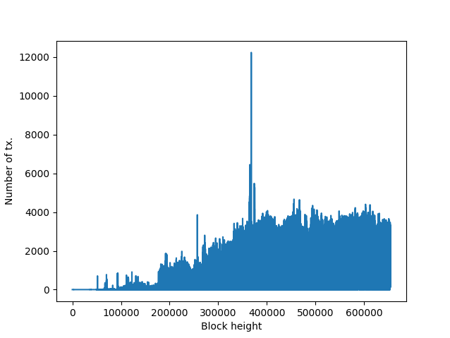
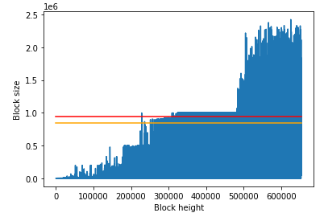
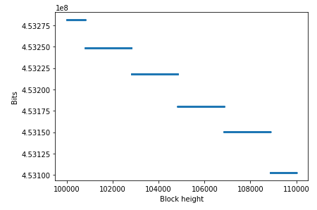
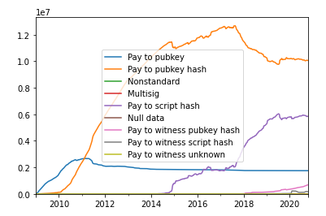
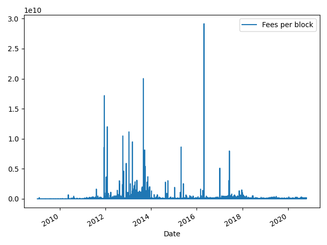
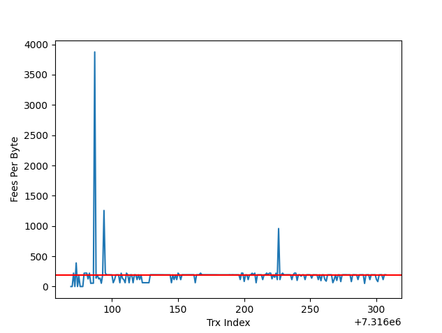
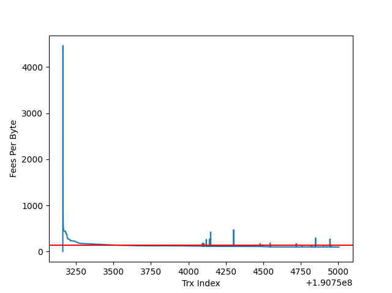

# Bitcoin-BlockSci
The goal of this project is to work with the BlockSci Python implementation tool to extract and analyze data from the Bitcoin blockchain.

The Bitcoin blockchain currently occupies more than 300GB of data. Both its size and the structure of this data make it difficult to analyze. Additionally, the file structure that Bitcoin Core uses to store the blockchain is not optimized for analysis.

BlockSci is an open-source tool that allows you to quickly analyze the Bitcoin blockchain (among others), as the BlockSci architecture is designed to optimize the analysis of the chain.

## Setup 

In order for the BlockSci library to be able to create the data structures based on the Bitcoin blockchain, it is necessary to parse the data from the Bitcoin Core blocks (the blkX.dat files) with the library.
To do so, the code shows how to create a Blockchain object with the Blockchain() function, passing the parser_data_directory as a parameter, which should be set to the data-directory which the blocksci_parser output. 

## Some Bitcoin blockchain queries & answers 

### 1. Basic stats 

_How many blocks are there in the blockchain?_

* 653853

_What is the size of all serialized blocks in the blockchain?_ 

* 306258808815

_How many transactions are there in the blockchain?_

* 580137370

_How many transactions are there in the first 100 blocks of the blockchain? And in the last 100 blocks?_ 

*  There are 100 transactions in the first 100 blocks of the blockchain. 

*  There are 241676 transactions in the last 100 blocks of the blockchain. 

### 2. Basic queries 

_Which is the hash of the block with the most number of transactions?_ 

* The block with the most number of transactions is at height 367853 and has 12239 transactions

    - Block hash: 00000000000000001080e6de32add416cd6cda29f35ec9bce694fea4b964c7be

_Which is the transaction in block 123456 with the most value in outputs?_ 

* The transaction with the most value in outputs (block 123456) is 0 and has 5005000000 satoshis

    - Tx hash: 5b75086dafeede555fc8f9a810d8b10df57c46f9f176ccc3dd8d2fa20edd685b

_Which is the hash of the transaction whose output is spent by the input of the second transaction of block 200000?_ 

* The second transacion of block 200000 have 2 inputs.

* The hashes of the transactions whose outputs are the spent by these inputs are: 

    - 7050b98c4215a00522ef90cfe13f45ddf2a4a199d348f377f56b0a47f5ee18e4

    - c410d173abbb7b0e4057d016cf67c100d3514e66d446b137cb021d6987982bbb

_Which is the hash of the transaction whose input spends the second output of the second transaction of block 200000?_

* The hash of the transaction whose input spends the second output of the second transaction of block 200000 is:

    - 1a40d11f1a8ac43c6e055549de0b323e4aa99dd7473b4aec85a7d4c044027807

_How many blocks do not have any fees at all_

* There are 125287 blocks without paying any fees to the miner

_... and how many of them are older than height 125000_

* There are 125287 blocks without paying any fees to the miner

_Is there any miner that did not collect his/her full reward (block reward + fees)?_

* There are 1123 miners that did not collected the full reward. 

_Is there any miner that did not even collect the block reward?_

* There are 3 miners that did not collected the block reward.

### 3. Plots with block and transaction data 

_How many transactions per block are there?_

_Which is the first block with more than one transaction?_

* The first block with more than one transaction is at height 170

_Are blocks currently full?_

_How does difficulty evolve?_

_What kind of scripts are used in blocks?_

_What is the hash of the first transaction with a multisignature output?_

* Block at height 164467 has the first multisig output

* Transaction 60a20bd93aa49ab4b28d514ec10b06e1829ce6818ec06cd3aabd013ebcdc4bb1 has the first multisig ever 

_A note on resampling: how much fees were paid by block?_

_Generate two plots showing the fees per byte payed by each transaction in block 200000 and block 450000. Which block is paying the highest fees per byte?_

* 190.4945394306214

* 132.65440875227063

